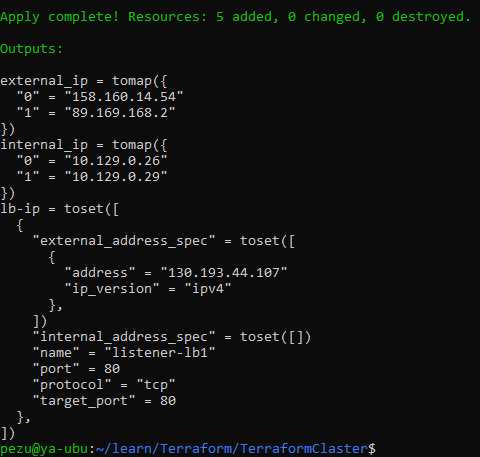
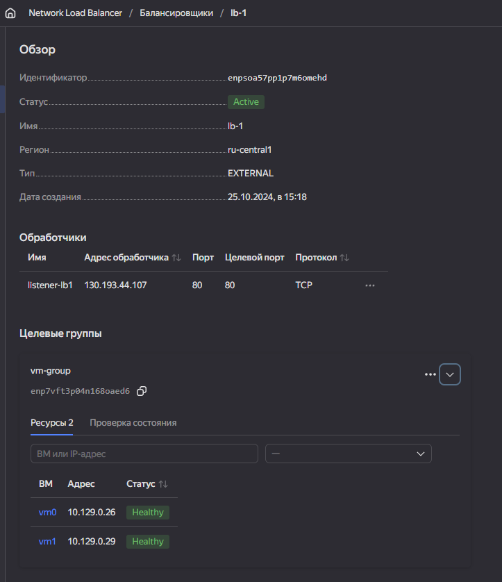
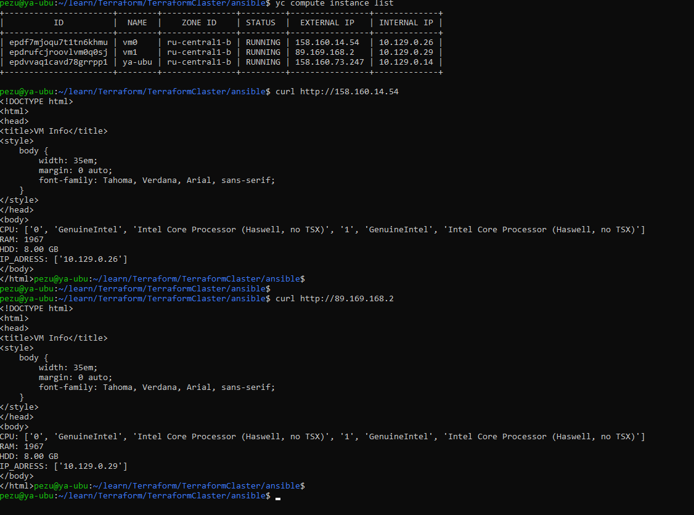

# Отказоустойчивость в облаке


## Terraform cfg

[main.tf](./main.tf)

[resources.tf](./resources.tf)

```
terraform apply
```


### Status



## Ansible

```
---
- name: Web-server
  gather_facts: true
  hosts: all
  become: yes
  roles: 
    - myrole

```

```
---
# tasks file for myrole
  - name: Install UFW.
    apt:
      name: ufw
      state: present
      update_cache: yes
      
  - name: Web-server install.
    apt: 
      name: nginx
      state: latest
      
  - name: Create test page
    import_tasks: create_web_page.yml   

  - name: Open tcp
    import_tasks: open_tcp.yml        

  - name: Check web-page 
    uri:
      url: "http://{{ ansible_facts.all_ipv4_addresses[0] }}"
```


### Request



